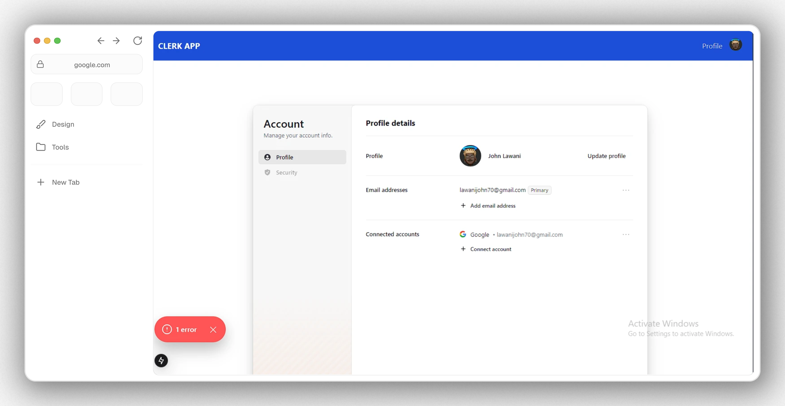
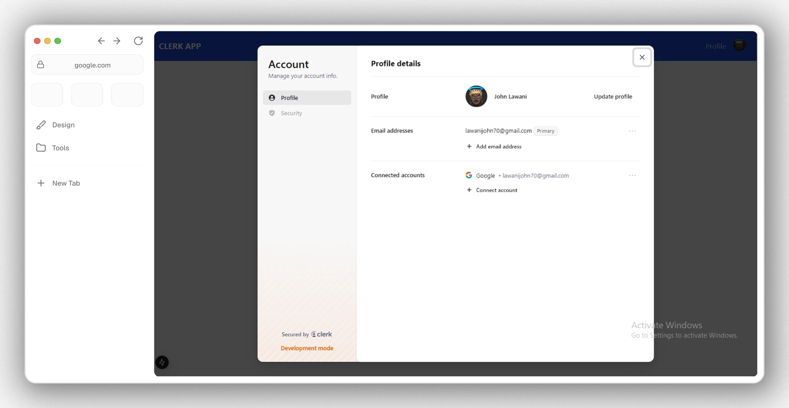
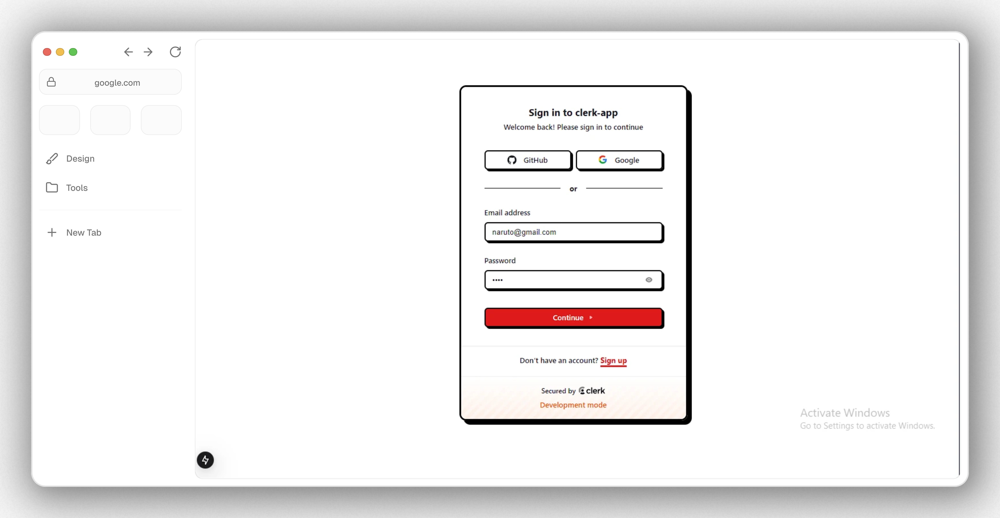

# Getting started with Clerk
  
## Getting started with clerk Phase 1 
<p align="center">
    <a href="#" style="display: block;" align="center">
        
    </a>
</p>

### What's Clerk?
Clerk authentication is a platform that helps developers create secure authentication systems for their applications. It offers a variety of authentication methods, including passwords, social media sign-on, and multi-factor authentication. 

### It's Benefits
1. Simplifies the authentication process for developers
2. Provides a seamless user experience
3. Ensures user data security
4. Reduces the need to build custom login and sign-up screens

### Getting started 
#### Set up your Clerk account
Before you can start integrating Clerk into your application, you need to create a Clerk account and set up a new application in the Clerk Dashboard. This guide will walk you through those steps.

1. Sign into Clerk
2. Create a Clerk application
3. Select your identifiers and social providers
4. Integrate Clerk into your application

## Integrating Clerk into our Next.Js Project
1. Install @clerk/nextjs
2. Set your Clerk API keys
Create your .env.local file. These keys can always be retrieved from the API Keys page of your Clerk Dashboard.
```bash
NEXT_PUBLIC_CLERK_PUBLISHABLE_KEY=pk_test_cmVhZHktaG91bmQtNjIuY2xlcmsuYWNjb3VudHMuZGV2JA
CLERK_SECRET_KEY=sk_test_gSjYiO5x9yd5qNaMGrSttDFubU3ai77jD3yaHqSjoq
```
3. Add your clerkMiddleware() to your app
clerkMiddleware() grants you access to user authentication state throughout your app, on any route or page. It also allows you to protect specific routes from unauthenticated users.

4. Add <ClerkProvider> and Clerk components to your app

5. Successfully Create your first user

## Getting started with clerk Phase 2
<p align="center">
    <a href="#" style="display: block;" align="center">
        
    </a>
</p>

This phase focuses on implementing user authentication using Clerk.js within the Next.js application.

**Implementation Details:**

* **Authentication Components:**
    * Integrated the `SignIn` component from `@clerk/nextjs` to provide a user login experience.
    * Utilized the `useAuth` hook to manage user authentication state within the application.
* **Header Component:**
    * Created a client-side rendered `Header` component for optimal performance.
    * Implemented conditional rendering of navigation links based on user authentication status:
        * When not signed in: Displays "Sign In" and "Sign Up" links.
        * When signed in: Displays a "Profile" link and the `UserButton` for user management (sign in, sign out, profile).

* **Home Page:**
    * Added initial content to the Home page, welcoming users and providing a brief overview of the application.

**Testing:**

* Thoroughly tested the authentication flow, including successful login, logout, and navigation to different pages based on authentication status.

This phase establishes a solid foundation for user authentication, enabling secure and personalized user experiences within the application.

**Output:**

* A functional user authentication system integrated into the Next.js application.
* A well-structured and reusable `Header` component that adapts to user authentication state.
* A basic Home page with initial content.





## Getting started with clerk operation Phase 3
<p align="center">
    <a href="#" style="display: block;" align="center">
        
    </a>
</p>

This phase focuses on implementing user creating user profile and styling which will enhance the user experience.

* **Implementing User Profile:** 
    * The `UserProfile` component from `@clerk/nextjs` displays the essential user information.
    import { UserProfile } from '@clerk/nextjs';
    ```javascript
    const ProfilePage = () => {
    return (
    <div>
      <UserProfile />
    </div>
  );
    }
    ```

* **Applying Custom Styling:** 
    * The `neobrutalism` theme from `@clerk/themes` enhances the application's visual appeal. 
    * Custom fonts (Geist Sans and Geist Mono) have been utilized for improved typography.

    **Applying the `neobrutalism` Theme:**

    ```javascript
    import { ClerkProvider } from "@clerk/nextjs";
    import { neobrutalism } from "@clerk/themes";

    export default function RootLayout({ children }) {
    return (
    <ClerkProvider appearance={{ baseTheme: neobrutalism }}> 
      {/* ... rest of the layout ... */}
    </ClerkProvider>
  );
    }
    ```

* **Layout Enhancements:**
    * The overall layout and structure of the application.




**Output:**

* **Functional User Profile:** Users can now view their basic profile information within the application.
* **Enhanced Visual Appeal:** The application now features the `neobrutalism` theme, providing a more visually engaging user experience.
* **Improved Typography:** Custom fonts enhance readability and contribute to a more polished look.
